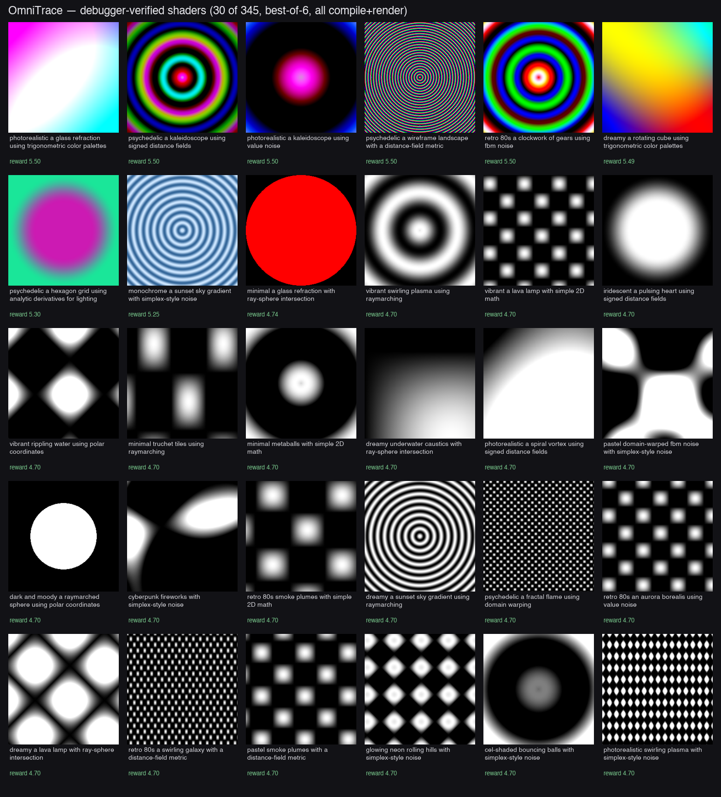

# DERS — Debugger Execution-Reward for Synthesis



A from-scratch, API/OS-agnostic GPU **shader debugger** (OmniTrace) in hyper-optimized C++, repurposed
as a **decomposed execution-level reward** for shader synthesis — plus the from-scratch C++ LLM
training/inference stack used to train the generators.

**The thesis:** a real debugger sees what a compiler cannot. A shader can *compile* yet render NaN, a
flat frame, or the wrong image. OmniTrace compiles, lifts to a universal IR, runs a CPU SIMT reference,
and renders on the real GPU — turning that into a reward (compile + runs-finite + renders + color +
semantic-match) that beats compile-only RLVR, and runs locally on a laptop.

## Layout
| Path | What |
|---|---|
| `src/`, `include/`, `tests/` | **OmniTrace** universal C++ shader debugger (UIR, SPIR-V front/back end, CFG, divergence-aware trace codec, CPU SIMT interpreter, time-travel, GPU capture/render via Vulkan/MoltenVK) |
| `tools/omni_reward.cpp` | the debugger as an RL reward (compile + run + GPU render: finite + variance + chroma) |
| `tools/omni_render.cpp`, `omnishader` | GPU renderer + local CLI (`debug`/`render`/`gen`/`loop`) |
| `tools/{rl,eval,pipeline,synth,cli}/` | debugger-in-the-loop RL + evaluation tooling |
| `pipeline/` | full training/synthesis pipeline (DoRA SFT, GRPO RL, generation, captioning, eval) |
| `training/` | from-scratch C++ LLM training + inference (LibTorch path + LibTorch-free CUDA-native trainer w/ custom kernels) |
| `REPORT.md`, `RESULTS.md` | measured results: zero-leak ablation, compiler-blind figure, training speeds, deliverables |

## Headline (zero-leak, measured)
- Base 7B **0.0** → DoRA SFT **0.90** → +debugger-RL **1.0** compile@1 (held-out NL prompts)
- Debugger reward **beats compile-only RLVR** on every metric (run/render a compiler is blind to)
- Best-of-N + debugger at inference: compile@1 0.85 → **0.988 usable@1**
- Deliverable runs **fully local** (4-bit, ~4 GB) on any laptop; debugger runs on Apple Silicon (MoltenVK)

## Flywheel — local, self-improving, no server
The richer debugger reward also runs at **inference time** to fight reward-hacking. Best-of-N alone
collapses toward whatever maxes raw luminance variance — concentric grayscale rings — because a ring is
the cheapest way to spike variance. `tools/cli/flywheel.py` re-ranks the N candidates by a reward that
rewards **color** (chroma), **caps** structure (no variance-hacking), and **penalizes radial symmetry**
(rings are rotation-invariant → low MSE vs a 90°-rotated copy), plus optional CLIP semantic match:

```
score = 0.45·color + 0.25·min(structure,cap) − 0.30·radial + 0.50·clip   (must compile + run, else −1)
```

Measured on a real best-of-6 (Apple M-series, 3B+adapter on MPS): a grayscale ring with **44× more
variance** scores **0.95**; the colorful, non-radial winner scores **1.70** — so the rerank picks color
over the collapse, locally, with no retrain.

Every call is logged to `flywheel_log.jsonl` as `(prompt, candidates, scores, chosen)`. The debugger
labels each one for free — no human annotation — so usage *is* training data. `tools/cli/retrain_local.py`
reads the log, keeps only the good examples (compiles + runs + non-ring + above the rerank bar), mixes a
corpus sample (anti-forgetting), and continues DoRA SFT **on the Mac (MPS)** → an improved adapter the
flywheel then serves. The more it's used, the better it gets.

```bash
# base = stock HF (re-downloadable); the trained adapter lives in Box:
huggingface-cli download Qwen/Qwen2.5-Coder-3B --local-dir local/qwen2.5-coder-3b
rclone copy box:nerc_server/adapters/rl3b_refined local/rl3b_refined   # the debugger-RL adapter (118 MiB)
export FLY_BASE=local/qwen2.5-coder-3b FLY_ADAPTER=local/rl3b_refined

python3 tools/cli/flywheel.py "neon city street at night" -n 8 --open   # generate, rerank, render, log
python3 tools/cli/retrain_local.py --min-score 1.4                       # retrain from accumulated logs
```
The base `qwen2.5-coder-3b` is stock HF; the trained `rl3b_refined` adapter (and the 4-bit GGUF/MLX
deliverables) persist in Box. The C++ debugger (`build/omni_reward`, `build/omni_render`) is the labeler
and runs on Apple Silicon via MoltenVK — the whole flywheel needs no GPU server.

## Build
```bash
cmake -S . -B build -G Ninja && cmake --build build && (cd build && ctest)
```
The C++ LLM trainer in `training/` builds separately (see `training/README.md`).

Authors: **Satrajit Ghosh**, **Dov Kruger**.

## Figures
*Debugger-verified shaders (best-of-6, every one compiles + renders), from the deliverable model.*

The thesis figure (a compiler is blind to broken shaders) — all three compile, only the debugger
reward tells them apart:
| `figures/thesis_good.png` | `figures/thesis_nan_compiles_but_broken.png` | `figures/thesis_flat_compiles_but_broken.png` |
|---|---|---|
| real image (reward 5.43) | NaN → blank frame (reward 2.50, exec=0) | flat/degenerate (reward 3.50, vis=0) |
